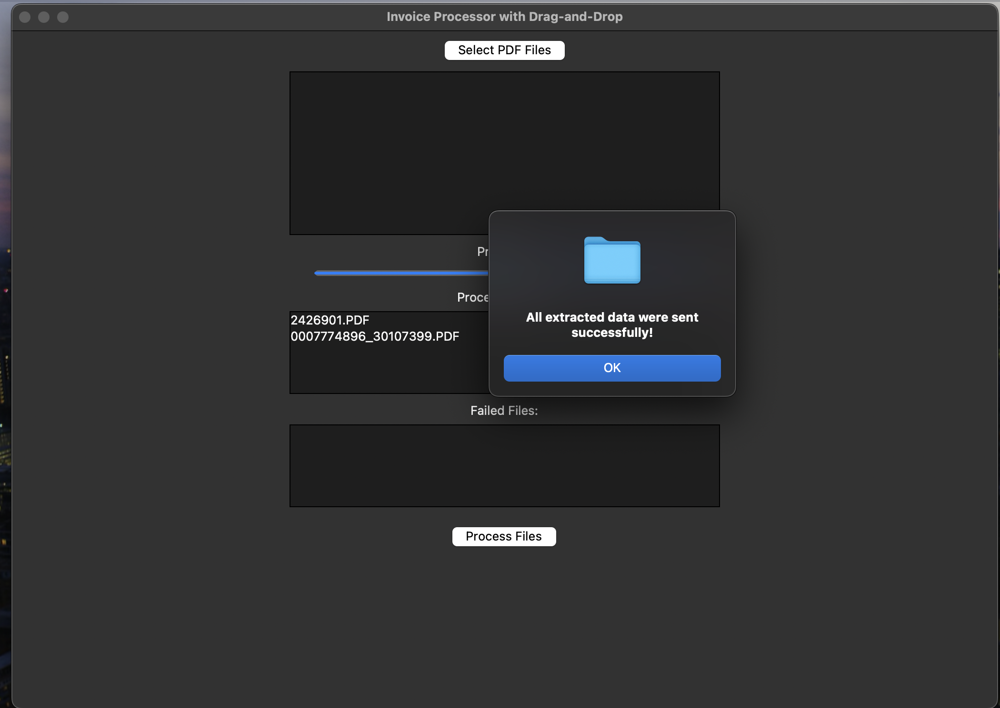

# Invoice Processor with Drag-and-Drop

This Python project is a GUI-based invoice processor that extracts data from PDF files and sends the extracted data to a webhook. It supports drag-and-drop functionality for selecting files.

## Features
- Drag-and-drop interface for selecting PDF files.
- Extracts text and images from PDF files.
- Uses OCR for extracting text from images.
- Sends extracted data to a configured webhook.
- Supports environment variables for sensitive data (e.g., OpenAI API key, webhook URL).

1. **UI**
    

2. **Success Message**
    

3. **Webhook Ingest**
    

---

## Prerequisites

### System Dependencies
To ensure the libraries work properly, you must install the following system dependencies:

#### Windows
- **Poppler**: Download and install Poppler binaries from [Poppler for Windows](http://blog.alivate.com.au/poppler-windows/). Add the `bin` directory to your PATH.
- **Tesseract-OCR**: Download and install Tesseract from [Tesseract GitHub](https://github.com/UB-Mannheim/tesseract/wiki). Add the installation directory to your PATH.

#### Linux
- **Poppler**: Install using your package manager (e.g., `sudo apt install poppler-utils` on Ubuntu/Debian).
- **Tesseract-OCR**: Install using your package manager (e.g., `sudo apt install tesseract-ocr`).

#### Mac
- **Homebrew**: Install Homebrew if not already installed. Follow the instructions at [Homebrew](https://brew.sh/).
- **Poppler**: Run `brew install poppler`.
- **Tesseract-OCR**: Run `brew install tesseract`.

---

## Python Setup

1. **Clone the Repository**
   ```bash
   git clone <repository-url>
   cd <repository-folder>
   ```
2. Create a Virtual Environment
    ```bash
    python -m venv venv
    source venv/bin/activate  # For Linux/Mac
    venv\Scripts\activate     # For Windows
    ```
3. Install Python Dependencies
    ```
    pip install -r requirements.txt
    ```
4. Configure Environment Variables

- Create a .env file in the project directory.
- Add the following variables:
    ```plaintext
    OPENAI_API_KEY=your_openai_api_key
    MAKE_WEBHOOK_URL=your_webhook_url
    ```

### Usage

Ensure the Poppler and Tesseract executables are in your system PATH.

If you encounter any issues, check that the required system dependencies are installed and properly configured.

Run in the terminal:
```
python pdf_reader_to_json.py
```
